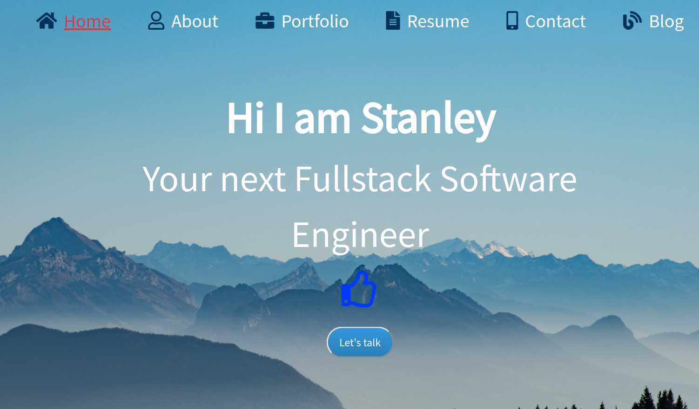
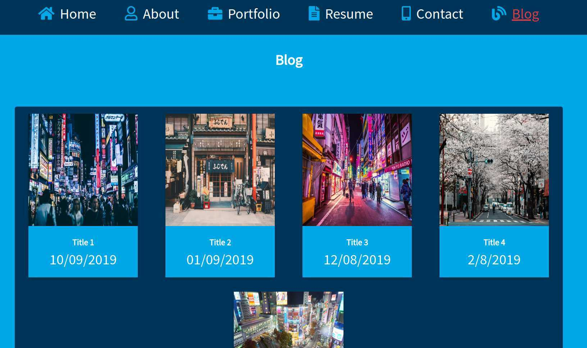
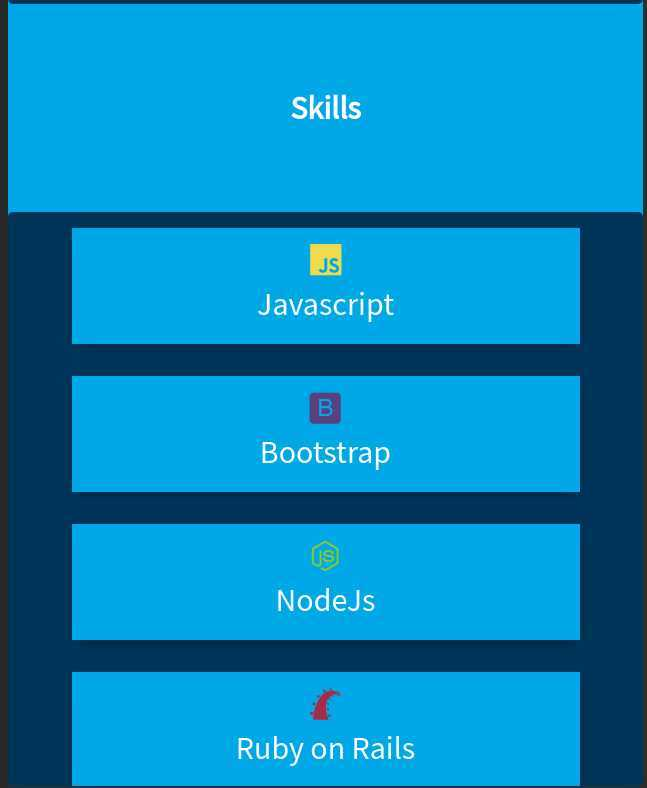
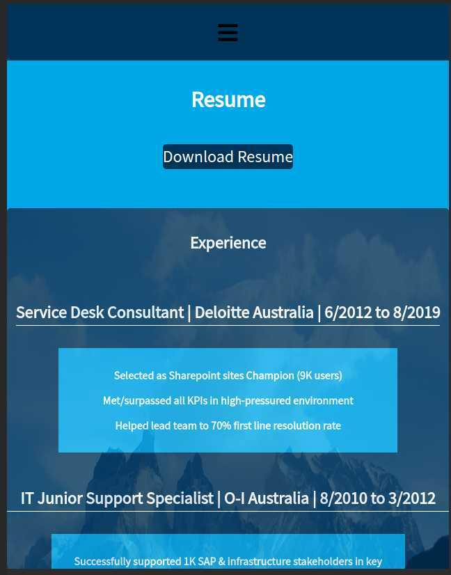
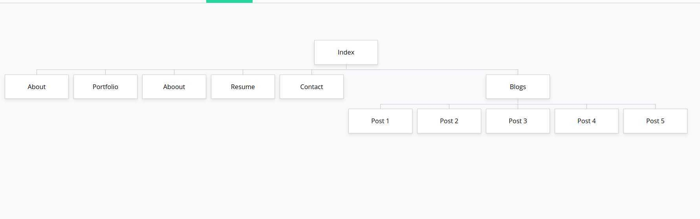

# Prototype Portfolio for Stanley

This is a prototype static HTML website to practice HTML, CSS and Javascript for my eventual portfolio site.

## Getting Started

**Deployed Website** [Live Website](https://prototype-stanley-portfolio.netlify.com)

**Github Repo** [Repo](https://github.com/HuangStanley050/prototype-portfolio)

## Description of the project

- Purpose

  > Using HTML, CSS and Javascript to build a website to showcase a website about myself for future employers and practice design skills.

  > Doing Extra practice with CSS especially with responsive website layout.

- Functionality/Features

  1. Usage of CSS animations in various parts of the web pages to make browsing more interesting.

  2. A simple hero image on the portfolio page using parallax scrolling effect.

  3. A contact form on the contact page using Formspree API for communication.

  4. A link on the resume page to download a PDF file of my resume from Google Drive.

- ScreenShots

  Index Page:
  

  Blog Page:
  

  Mobile view 1:
  

  Mobile view 2:
  

* Target Audience

This page is meant for potential employers to have a chance to view my portfolio and get in touch with myself if necessary and also for the lovely educators at CoderAcademy to assess and provide feedbacks to my frontend skills.

- Tech Stack

  - HTML
  - CSS
  - Javascript
  - SRI
  - Formspree
  - Netlify
  - Github

* Site Map

